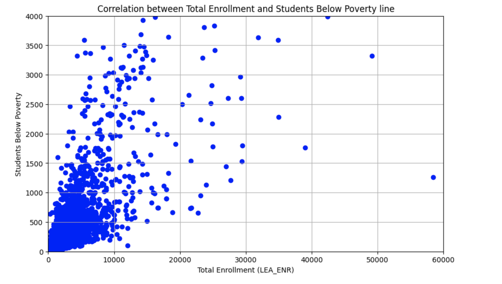
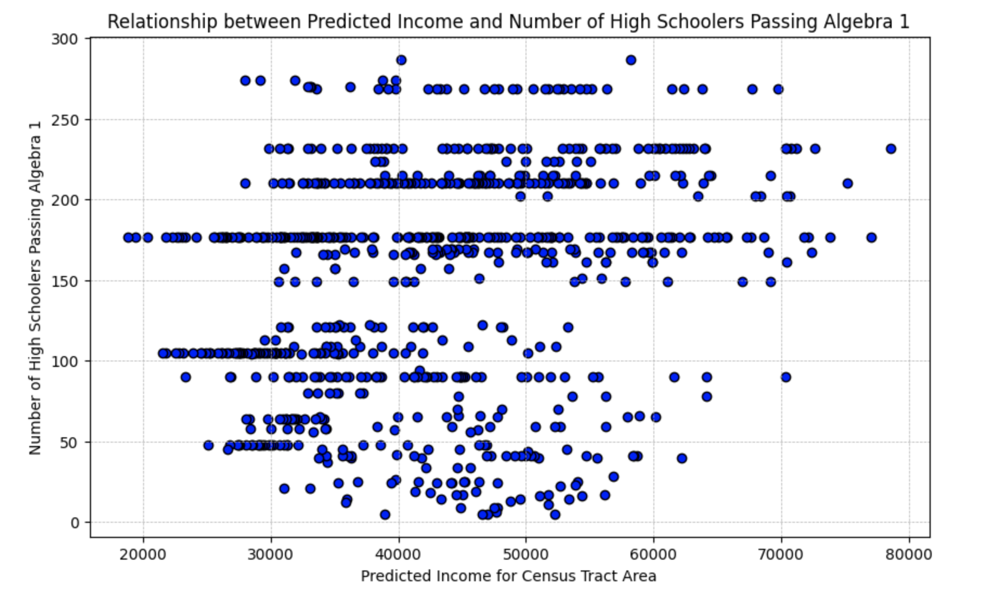

Data Challenge Text File

### 2.2.3  Answer 2
> The “Text Import Wizard ” would guide you through the process of identifying variables
by column. Import it and determine the total number of school districts.

There were 17604 school districts between 2017-2018 according to the excel file 

		
### 2.2.3 Answer 2
> The previous file counts the total number of rows in the file. Does this number coincide with the number produced by Excel? 

The python method of counting rows does not accurately count the rows in the dataset because it interprets newlines wrapped in double quotes as a new row of data. This adds 9 new rows of data which are counted as school districts.

We used chat gpt to write a python script that could find these data anomalies an example 
of one of these data anomalies can be found online 14041 of the `LEA Characteristics.csv` data file :
```
","jswan@reach.connectionsacademy.org","JANE","SWAN","7177048437
","jswan@reach.connectionsacademy.org","JANE","SWAN","7177048437
","jswan@reach.connectionsacademy.org","No","Yes","Yes","www.connexus.com","No"
```


###  2.2.3  Answer 3
> Why would you need encoding=“cp1252” for US data?

cp1252 is needed for encoding spanish characters like ñ on cell `D2797`

```txt
CA	CALIFORNIA	06CC340	Opportunities for Learning ñ Duarte
CA	CALIFORNIA	06CC341	Options for Youth ñ San Bernardino
```


### Answer 4	
> This number does not match the CRDB database, but both databases claim to have the list of school districts in the US in the period 2017-18. Explain why

```shell
sqlite-utils lea_vs_edge.db "SELECT e.*
FROM edge e
LEFT JOIN lea l ON e.leaid = l.leaid
WHERE l.leaid IS NULL;" >> in_edge_not_lea.json
```


## 2.4 Intermediate Challange

### Importing Data From CSV to a Postgres DB

We used pandas and sqlalchemy to import the CRDC csv files to our
postgresql database, the file names were used as table names.
```python
valid_csvs = glob.glob(f"GRF17/csv/**/*.csv", recursive=True)
for csv in valid_csvs:
	table_name = csv.split("/")[-1].split(".")[0]
	table_name = table_name.replace(" ", "_").replace("-", "_")
	csv_to_sql(csv, table_name, engine, encoding="cp1252")
```


### Correlation between poverty and total enrollment 



### Census income report correlation with highschool accademic performance 
> school districts to census tracts and determine whether the income reported in the Opportunity Atlas has correlation with academic performance in high school

Scatter plot showing the relationship between 
total number of students in Bexar count who passed algebra 1 and their predicted income at the age of 
35 by Opportunity Atlas.




